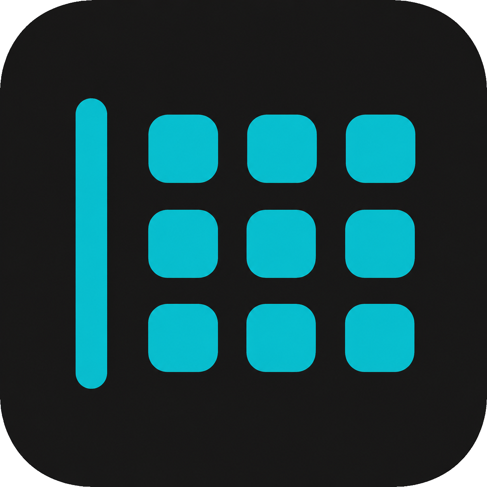
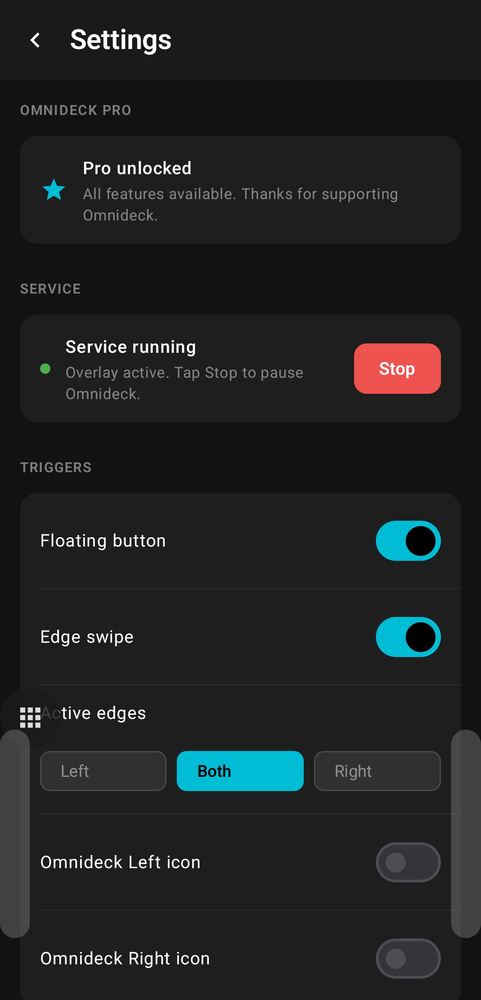

# Omnideck

### Your whole phone, one swipe away

**A private floating launcher: apps, actions & widgets, one swipe away.**

---

Omnideck is a floating launcher that lives quietly on the edge of your screen. Swipe in from the side, or tap a floating button, and a compact panel appears right where you are - no jumping back to the home screen, no digging through app drawers. Tap what you need, and the panel tucks itself away again.

It is built to be fast, tidy, and completely yours.

---

## 💬 Feedback, bug reports & feature requests

This repository is the home for **reporting issues and requesting features** for Omnideck.

- 🐞 **Found a bug?** [Report a bug](../../issues/new?template=bug_report.yml) and tell us what happened, what you expected, and your device / Android version.
- 💡 **Have an idea?** [Request a feature](../../issues/new?template=feature_request.yml) - I read every suggestion.
- 👍 **Want something that's already been suggested?** Browse [bug reports](../../issues?q=is%3Aissue+label%3Abug) and [feature requests](../../issues?q=is%3Aissue+label%3Aenhancement) and add a 👍 or a comment so I know it matters to you.

Please search the [open issues](../../issues) first to avoid duplicates.

---

## ✨ What you can do

- **Launch anything** - apps, shortcuts, contacts, and websites all live together in one neat panel.
- **System actions at a glance** - flip on the flashlight, rotate the screen, and more without leaving what you are doing.
- **Stay organized** - group items into folders and swipe between pages to keep everything a single tap away.
- **Live widgets in the popup** - drop your favourite widgets straight into the panel, then move and resize them on a simple grid.
- **Make it yours** - choose custom icons from built-in Material icons, your own icon packs, contact photos, or images from your gallery.
- **Open it your way** - use a gentle edge-swipe strip, a movable floating button, or both, on either side of the screen.

---

## 📸 Screenshots

 

 

 

---

## 🔒 Private by design

Omnideck respects your privacy from the ground up:

- **No account, no sign-up, no login. Ever.**
- **No ads. No trackers. No hidden analytics** building a profile of you.
- **Your layout stays on your device** - there is no cloud sync and no automatic cloud backup.
- **Backups belong to you** - export and import your setup as a simple file that only you control.
- The app asks only for what a launcher genuinely needs, and every request is explained in plain language.

---

## 🔑 Permissions, explained honestly

- **Display over other apps** - this is what lets the panel float above whatever you are using.
- **See your installed apps** - so Omnideck can show them for you to launch. That list never leaves your phone.
- **Contacts (optional)** - only if you want quick contact shortcuts. Skip it and everything else still works.
- **Accessibility service (optional, OFF by default)** - Omnideck uses Android's Accessibility Service for two things, and only when you choose to turn them on:
  1. **System navigation shortcuts from the panel** - Back, Home, Recents, Notifications, Quick Settings, Lock screen, Screenshot, and Split screen. Android only exposes these actions through the Accessibility Service (`performGlobalAction`), so the panel relies on it to trigger them.
  2. **Keyboard avoidance** - detecting when the on-screen keyboard opens so the panel can slide out of its way (a Pro feature).

  Omnideck does **NOT** read, record, log, collect, or transmit the contents of your screen or anything you type. No accessibility data is stored or leaves your device. The service is optional and disabled by default; you can turn it off at any time in **Android Settings → Accessibility** or from Omnideck's Permissions screen, and every other feature keeps working without it.

---

## 💎 Free, with an optional one-time upgrade

The free version is genuinely useful all on its own: a full launcher panel, every action type, folders, custom icons, and both ways to open it.

**Omnideck Pro** is a single one-time purchase - no subscriptions, ever. It unlocks the extra polish and customization:

- Resize the grid and add more pages
- Widget pages
- Popup appearance, position, and behaviour
- Smooth animations and haptic feedback
- Floating-button styling and keyboard avoidance
- Backup and restore

Buy it once and it is yours to keep.

---

Omnideck is for anyone who wants their phone to feel faster and calmer: everything you reach for most, always a swipe away - and nothing looking over your shoulder.

