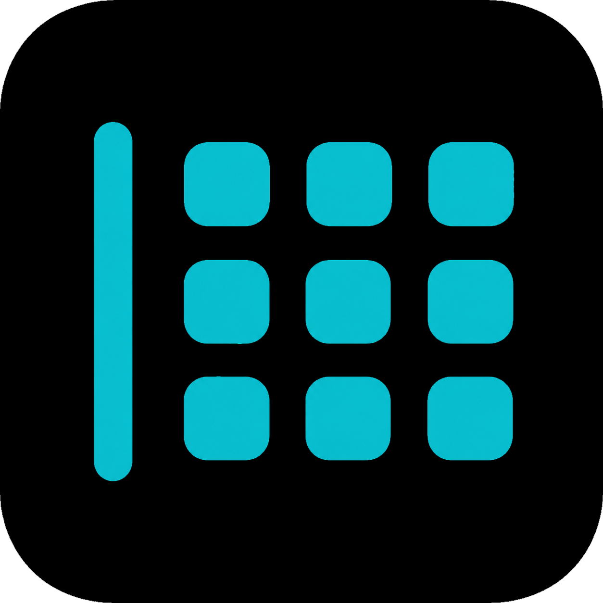

# Omnideck

### Your whole phone, one swipe away

**A private floating launcher: apps, contacts, widgets & actions, one swipe away.**

  

---

Omnideck is a floating launcher that lives quietly on the edge of your screen. Swipe in from the side, or tap a floating button, and the **Deck** appears right where you are - no jumping back to the home screen, no digging through app drawers. Tap what you need, and it tucks itself away again.

Beside the Deck there are **Panels**: an A-Z app index and a contacts index, each with its own trigger.

It is built to be fast, tidy, and completely yours.

---

## 💬 Feedback, bug reports & feature requests

This repository is the home for **reporting issues and requesting features** for Omnideck.

- 🐞 **Found a bug?** [Report a bug](../../issues/new?template=bug_report.yml) and tell us what happened, what you expected, and your device / Android version.
- 💡 **Have an idea?** [Request a feature](../../issues/new?template=feature_request.yml) - I read every suggestion.
- 👍 **Want something that's already been suggested?** Browse [bug reports](../../issues?q=is%3Aissue+label%3Abug) and [feature requests](../../issues?q=is%3Aissue+label%3Aenhancement) and add a 👍 or a comment so I know it matters to you.

Please search the [open issues](../../issues) first to avoid duplicates.

---

## ✨ The Deck

- **Launch anything** - apps, app shortcuts, activities, inner links (an app's own screens and deep links), custom intents, Android settings screens, files, contacts, websites, saved texts and HTTP requests, all in one panel.
- **Add action, eleven tabs** - Apps, System, Activities, Intents, Inner links, Shortcuts, Files, Websites, Contacts, Text and HTTP. A **Test** button tries an activity or intent before you add it, and screens other apps can't open are marked.
- **System actions at a glance** - Back, Home, Recents, Previous app, Notifications, Quick settings, Split screen, Lock screen, Screenshot, Power menu, Assistant, Torch, volume and mute, media controls (play / pause, previous, next, stop), rotation and Auto-rotate, Screen timeout, Adaptive brightness, and more.
- **Live widgets** - drop your favourite widgets straight into the Deck, then move and resize them on the grid, with zoom control for widgets that don't fit.
- **Stay organised** - folders, multiple pages, a page manager, and a grid size you choose (up to 20 x 20, per page if you like).
- **Scroll your way** - flip pages left/right or up/down, or switch to one continuous strip that can loop endlessly.
- **Edit in place** - in edit mode, tap an item to edit it, hold and drag to move it; icons and widgets make room for each other as you drag.
- **Pin it** - keep the Deck on screen and drag it wherever you want it; a "Show / hide Deck" action closes it again.
- **Where it opens** - left, right or centre, at a height you set or right at your finger.
- **Stays out of the way** - close after an action, auto-close after a delay, and move up or click through when the keyboard opens.

---

## 🌐 HTTP requests & Wake-on-LAN

- **Save web requests** (GET, POST, PUT, PATCH, DELETE) with headers, a JSON, text or form body, Basic or Bearer authentication and a timeout - all on one page.
- **Wake-on-LAN** - wake a computer on your network with a magic packet.
- **Import from cURL** - paste a cURL command (also Chrome's "Copy as cURL") and the request fills itself in.
- **Test before saving**, then run it from the Deck, a gesture or the Action wheel.
- **Show the result your way** - a toast, a notification, a dialog, or a full-screen window with the response details, a JSON table, and Copy / Share / Save / Run again.
- **Variables** - write `{{name}}` in a URL, header or body. A variable can be a fixed value, ask you for a text, number, password, date, time, colour or a choice when the request runs, or switch between values on each run. Answers can be JSON-encoded, multi-line, and remembered for next time.
- **Site icons** - websites and requests can fetch the site's own icon.

---

## 📚 Library

Settings > General > Library lets you edit, duplicate or delete your saved **texts**, **HTTP requests** and **websites** without going through Add action, and shows where each one is in use before you delete it. It opens directly from `omnideck://open/library` (also `/texts`, `/http`, `/websites`).

---

## 📝 Saved texts

Keep texts you type often and paste them into the field you're typing in, from the Deck, a gesture or the Action wheel.

---

## 🗂️ Panels

Two extra surfaces, each with its own trigger, gesture binding and launcher shortcut:

- **App index** - an A-Z rail of every installed app. Slide down the rail and tap the app; long-press for App info, Add to Deck or Uninstall. Hide the apps you never want to see there.
- **Contacts** - your contacts on the same rail, opening on your favourites. Tap someone to get their numbers, emails and address, each with its own call, message, copy or map action - plus the actions WhatsApp, Viber, Telegram and others add themselves. Sort by given or family name, pick a default number, and choose which app actions appear. A whole contact can sit on the Deck for one-tap access.

---

## 🎨 Make it yours

- **75 built-in themes**, **Material You** colours from your wallpaper, or mix your own palette.
- **Dozens of animations** - open/close, folders, taps, 40+ page transitions and 36 show / hide animations for the floating button, each with a live preview and its own speed (0.5x to 2x).
- **Now playing on the button** - while music or video plays, the floating button can show the album art or an animation: Record, Tape, CD, Equalizer, Pulse, Notes, Wave or Ticker.
- **Custom icons** - built-in Material icons, your own icon packs (or one default pack for every app), contact photos, gallery images, or 50+ animated icons for the floating button.
- **Every dimension** - size, shape, position, opacity, corner radius, borders, padding, labels and the toolbar.
- **Light, dark or automatic** for the app's own screens, independently of the overlay theme.

---

## 👆 Open it your way

- **Edge-swipe strips** on either side, with a visual hint you can show or hide and a touch area you drag into place on screen.
- **Directional gestures** - short and long swipes in five directions per strip (and eight around the floating button), each bound to any action. Set the angles visually, and how long to hold for a long swipe. Give each strip its own set, or let both share one with **Mirror**.
- **A movable floating button** - snap it to an edge (half hidden), fling it, choose a different shape when snapped, and let it rotate with the screen or stay put.
- **The Action wheel** - swipe from the floating button or an edge, slide onto one of the actions around your finger and lift to run it. Pick the actions, icons and names in its own editor; each edge strip can have its own wheel.
- **Swipe-through launch** - keep your finger down after the Deck opens, slide onto an item and lift to open it.
- **Per-app rules** - in the apps you pick, hide the triggers, let taps go through, or snap / unsnap the button. Triggers can also hide in fullscreen apps and the button in landscape.
- **Everywhere else** - launcher long-press shortcuts (left and right, for the Deck and each panel), extra home-screen icons, `omnideck://` links, and intents for Tasker or MacroDroid.
- **Works with Bottom notifications** - if you own it, a gesture or wheel slot can open its notification shade.

---

## 🛠️ And also

- **Backup & restore** - your whole setup in one file you control; a file from another app or a newer Omnideck is refused before anything changes.
- **What's new** and an **update checker** inside the app.
- **Second-finger protection** - a second finger touching the strip or the button never sets it off.

---

## 📸 Screenshots

 

 

 

 

  

**Full settings tours (long captures):**
[General](Screenshots/Settings%20-%20general.jpg) ·
[Triggers](Screenshots/Settings%20-%20triggers.jpg) ·
[Panels: Deck](Screenshots/Settings%20-%20panels-%20deck.jpg) ·
[Panels: App index](Screenshots/Settings%20-%20panel%20-%20app%20index.jpg) ·
[Panels: Contacts](Screenshots/Settings%20-%20panel%20-%20contacts.jpg)

---

## 🔒 Private by design

Omnideck respects your privacy from the ground up:

- **No account, no sign-up, no login. Ever.**
- **No ads. No trackers. No hidden analytics** building a profile of you.
- **Your layout stays on your device** - there is no cloud sync and no automatic cloud backup.
- **Backups belong to you** - export and import your setup as a simple file that only you control.
- The app asks only for what a launcher genuinely needs, and every request is explained in plain language.

---

## 🔑 Permissions, explained honestly

- **Display over other apps** - this is what lets the panel float above whatever you are using.
- **See your installed apps** - so Omnideck can show them for you to launch. That list never leaves your phone.
- **Notifications (optional, recommended)** - lets Android show the small, quiet notification that keeps Omnideck running in the background. You can minimise it in your notification settings.
- **Battery optimisation exemption (optional, recommended)** - stops Android from freezing or closing Omnideck in the background, so the edge strips and the floating button keep working.
- **Contacts (optional)** - only for the Contacts panel and contact shortcuts. Skip it and everything else still works.
- **Modify system settings (optional)** - only for the screen-rotation, Auto-rotate, Screen timeout and Adaptive brightness actions.
- **Internet** - only for the HTTP requests and Wake-on-LAN packets you set up yourself, and for fetching a website's icon when you ask for it. Omnideck sends nothing about you anywhere.
- **Usage access (optional)** - only to see which app is in front, so triggers can behave differently in the apps you pick (hide, click through, snap or unsnap). Omnideck never reads your usage history.
- **Accessibility service (optional, OFF by default)** - Omnideck uses Android's Accessibility Service for three things, and only when you choose to use them:
  1. **System navigation shortcuts from the panel** - Back, Home, Recents, Notifications, Quick Settings, Lock screen, Screenshot, and Split screen. Android only exposes these actions through the Accessibility Service (`performGlobalAction`), so the panel relies on it to trigger them.
  2. **Keyboard avoidance** - detecting when the on-screen keyboard opens so the panel can slide out of its way (a Pro feature).
  3. **Pasting saved texts** - an action you set up pastes a text you saved in Omnideck into the text field you are typing in. Omnideck only asks which field has focus and pastes into it; it never reads the field or anything else on screen.

  Omnideck does **NOT** read, record, log, collect, or transmit the contents of your screen or anything you type. No accessibility data is stored or leaves your device. The service is optional and disabled by default; you can turn it off at any time in **Android Settings → Accessibility** or from Omnideck's Permissions screen, and every other feature keeps working without it.

---

## 💎 Free, with an optional one-time upgrade

The free version is genuinely useful all on its own: a full launcher panel, every action type (HTTP requests, Wake-on-LAN and saved texts included), the Library, folders, custom icons, contact menus, themes, Material You, and both ways to open it.

**Omnideck Pro** is a single one-time purchase - no subscriptions, ever. It unlocks the extra polish and customization:

- Bigger grids and extra pages
- Deck appearance, position, and behaviour
- Page transitions, animations and haptic feedback
- Vertical and continuous scrolling
- The App index and Contacts panels
- Directional gestures and the Action wheel
- Swipe-through launch
- Floating-button styling, animations and keyboard avoidance
- Per-app trigger rules and fullscreen / landscape behaviour
- Backup and restore

Buy it once and it is yours to keep.

---

## 🌍 Languages

Omnideck is available in **50 languages** and follows your phone's language automatically:

Arabic, Bengali, Bulgarian, Catalan, Chinese (Simplified), Croatian, Czech, Danish, Dutch, English, Estonian, Finnish, French, German, Greek, Gujarati, Hebrew, Hindi, Hungarian, Icelandic, Indonesian, Italian, Japanese, Kannada, Korean, Latvian, Lithuanian, Malayalam, Marathi, Norwegian, Persian, Polish, Portuguese (Brazil and Portugal), Punjabi, Romanian, Russian, Serbian (Cyrillic and Latin), Slovak, Slovenian, Spanish, Swahili, Swedish, Tamil, Telugu, Thai, Turkish, Ukrainian, Urdu, Vietnamese and Zulu.

If something reads wrong in your language, please [report it](../../issues/new?template=bug_report.yml).

---

## 📌 A few things to know

- Available in **50 languages** (see above).
- Works on **Android 10 and newer**.
- Some phones aggressively close background apps. If the edge strips or the floating button ever stop responding, the in-app tips help keep Omnideck running.

---

Omnideck is for anyone who wants their phone to feel faster and calmer: everything you reach for most, always a swipe away - and nothing looking over your shoulder.

